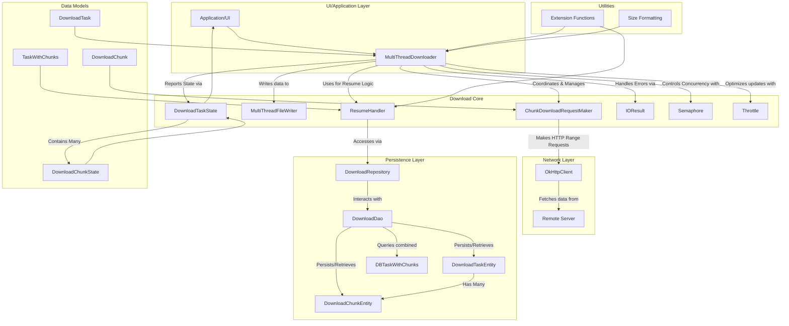

# Android 多线程下载器模块

## 概述

这是一个基于 Kotlin 协程和 OkHttp 实现的 Android 多线程下载器模块。它旨在提供一个高效、稳定且支持断点续传的文件下载解决方案。该模块将大文件分割成多个小块进行并行下载，并通过 Room 数据库持久化下载进度，确保在网络中断或应用重启后能够从上次中断的地方继续下载。

## 核心特性

*   **多线程/协程并发下载**：利用 Kotlin 协程实现高效的并行下载。
*   **断点续传**：支持从上次中断的地方恢复下载，提升用户体验。
*   **文件分块下载**：将大文件分割成小块，通过 HTTP Range 请求并行下载。
*   **持久化存储**：使用 Android Room 数据库持久化下载任务和分块进度。
*   **性能优化**：包括文件预分配、进度节流、并发限制等。
*   **类型安全**：采用 Kotlin `sealed interface` 进行状态管理和错误处理。
*   **模块化设计**：职责分离，代码结构清晰，易于维护和扩展。

## 技术栈

*   **语言**：Kotlin
*   **并发**：Kotlin Coroutines (`kotlinx.coroutines`)
*   **网络**：OkHttp
*   **持久化**：Android Room Persistence Library
*   **日志**：`com.zephyr.log` (自定义日志库)

## 模块结构

以下 Mermaid 图表展示了下载模块的主要组件及其交互关系：



## 关键数据结构

*   **`DownloadTask` (protocol/DownloadTask.kt)**:
    *   定义一个下载任务的基本信息，如 `url`、`totalSize`、`targetPath` 和 `fileName`。
    *   作为业务逻辑层启动下载的输入参数。
*   **`DownloadChunk` (protocol/DownloadTask.kt)**:
    *   定义文件的一个逻辑分块，包含 `index`、`startByte` 和 `endByte`。
    *   用于 HTTP Range 请求，实现并行下载。
*   **`DownloadTaskState` (protocol/DownloadTaskState.kt)**:
    *   表示整个下载任务的实时状态，包含 `url`、`targetPath`、`totalSize` 和一个 `List<DownloadChunkState>`。
    *   提供 `totalDownloadedBytes` 和 `totalDownloadedPercent` 属性，方便获取整体进度。
*   **`DownloadChunkState` (protocol/DownloadTaskState.kt)**:
    *   表示单个下载分块的实时状态，包含 `index`、`startByte`、`endByte` 和 `downloadedBytes` (可变)。
    *   提供 `totalBytes`、`isCompleted` 和 `downloadedPercent` 属性。
*   **`IOResult` (IOResult.kt)**:
    *   一个 `sealed interface`，用于封装 I/O 操作的成功 (`Success<T>`) 或失败 (`Error`) 结果。
    *   强制调用者处理所有可能的结果，提供类型安全的错误处理。
*   **`DownloadTaskEntity` (room/entity/DownloadTaskEntity.kt)**:
    *   Room 数据库实体，映射到 `download_tasks` 表，持久化 `DownloadTask` 的元数据。`url` 作为主键。
*   **`DownloadChunkEntity` (room/entity/DownloadChunkEntity.kt)**:
    *   Room 数据库实体，映射到 `download_chunks` 表，持久化 `DownloadChunk` 的信息和 `downloadedBytes`。
    *   通过外键 `task_url` 关联 `DownloadTaskEntity`，并设置 `onDelete = ForeignKey.CASCADE` 实现级联删除。
*   **`DBTaskWithChunks` (room/entity/DBTaskWithChunks.kt)**:
    *   Room POJO，用于方便地查询一个 `DownloadTaskEntity` 及其所有关联的 `DownloadChunkEntity` 列表。
    *   使用 `@Embedded` 和 `@Relation` 注解定义关系。
*   **`TaskWithChunks` (protocol/TaskWithChunks.kt)**:
    *   一个数据类，用于在业务逻辑层聚合 `DownloadTaskState` 和其所有关联的 `DownloadChunkState` 列表，方便数据传递。

## 重要类及其职责

*   **`MultiThreadDownloader` (MultiThreadDownloader.kt)**:
    *   **核心协调者**：管理整个下载生命周期，包括任务初始化、分块调度、进度更新、错误处理和资源清理。
    *   **并发控制**：使用 `kotlinx.coroutines.sync.Semaphore` 限制同时进行的下载块数量。
    *   **断点续传集成**：与 `ResumeHandler` 协作处理断点续传逻辑。
    *   **进度回调**：通过 `onStateChanged` 回调报告下载状态。
*   **`MultiThreadFileWriter` (MultiThreadFileWriter.kt)**:
    *   **文件 I/O 管理**：负责向本地文件写入下载数据。
    *   **随机写入**：使用 `java.io.RandomAccessFile` 实现对文件任意位置的写入。
    *   **并发安全**：使用 `kotlinx.coroutines.sync.Mutex` 确保多协程并发写入时的文件访问安全。
    *   **文件预分配**：在下载开始时预分配文件空间，优化写入性能。
*   **`DownloadRepository` (room/DownloadRepository.kt)**:
    *   **数据访问抽象**：作为业务逻辑层和 Room 数据库之间的抽象层。
    *   **数据模型转换**：负责 `DownloadTask`/`DownloadChunk` 与 `DownloadTaskEntity`/`DownloadChunkEntity` 之间的转换。
    *   **提供 CRUD 接口**：封装了 `DownloadDao` 的所有数据库操作。
*   **`DownloadDao` (room/DownloadDao.kt)**:
    *   **Room DAO**：定义了与 `download_tasks` 和 `download_chunks` 表交互的所有数据库操作（插入、更新、查询、删除）。
    *   **事务支持**：使用 `@Transaction` 确保复合操作的原子性。
*   **`ResumeHandler` (util/ResumeHandler.kt)**:
    *   **断点续传逻辑**：负责检查现有下载记录的有效性，根据情况决定是恢复下载还是重新开始。
    *   **状态准备**：准备下载器所需的初始 `DownloadTaskState` 和 `DownloadChunkState` 数据。
    *   **历史清理**：删除无效的旧下载记录。
*   **`ChunkDownloadRequestMaker` (util/ChunkDownloadRequestMaker.kt)**:
    *   **HTTP 请求构建**：使用 `OkHttpClient` 为每个 `DownloadChunk` 构建带有 HTTP `Range` 头部的下载请求。
    *   **请求执行**：发送请求并返回 `okhttp3.Response`。

## HTTP 实现细节

*   **OkHttp 客户端**：使用 `OkHttpClient` 作为底层的 HTTP 客户端，它提供了高性能的网络请求能力，包括连接池、请求重试等。
*   **HTTP Range 请求**：`ChunkDownloadRequestMaker` 是实现分块下载的关键。它在 HTTP 请求头中添加 `Range: bytes=startByte-endByte`，指示服务器只返回文件指定字节范围的数据。这使得 `MultiThreadDownloader` 可以同时从文件的不同部分下载数据。
*   **响应处理**：`ChunkDownloadRequestMaker` 仅负责发起请求并返回 `Response`。响应体的读取和写入文件流的逻辑由 `MultiThreadDownloader` 和 `MultiThreadFileWriter` 负责，实现了职责分离。
*   **错误码处理**：`ChunkDownloadRequestMaker` 会检查 HTTP 响应码，如果不是 2xx 成功状态码，则抛出 `IOException`。

## 并发实现细节

*   **Kotlin 协程**：整个下载过程高度依赖 Kotlin 协程。`MultiThreadDownloader` 在 `coroutineScope` 中为每个 `DownloadChunk` 启动一个独立的 `launch` 协程。
*   **`Dispatchers.IO`**：所有网络请求和文件 I/O 操作都在 `Dispatchers.IO` 上执行，确保不会阻塞主线程，保持 UI 响应性。
*   **`joinAll()`**：`MultiThreadDownloader` 使用 `jobs.joinAll()` 等待所有分块下载协程完成，以确保整个任务的完整性。
*   **`Semaphore` (信号量)**：`MultiThreadDownloader` 使用 `kotlinx.coroutines.sync.Semaphore` 来限制同时运行的下载块协程的数量（默认为 2）。这有助于控制并发度，防止过多的并发请求导致服务器压力过大或客户端资源耗尽。
*   **`Mutex` (互斥锁)**：`MultiThreadFileWriter` 使用 `kotlinx.coroutines.sync.Mutex` 来保护对 `RandomAccessFile` 的并发写入。尽管 `RandomAccessFile` 支持随机写入，但多个协程同时操作文件指针或写入数据可能导致混乱，`Mutex` 确保了文件写入的原子性和数据完整性。

## 断点续传机制

1.  **持久化进度**：
    *   `DownloadTaskEntity` 存储任务元数据。
    *   `DownloadChunkEntity` 存储每个分块的 `startByte`、`endByte` 和 `downloadedBytes`。
    *   这些信息通过 Room 数据库持久化。
2.  **`ResumeHandler` 检查**：
    *   当一个下载任务启动时，`ResumeHandler` 会首先查询数据库，查找该 URL 对应的历史记录。
    *   它会检查历史记录的有效性，包括：
        *   是否存在历史记录。
        *   历史记录中的 `totalSize` 是否与当前请求下载的文件大小一致。
        *   `targetPath` 是否一致。
        *   目标文件是否实际存在于文件系统中。
3.  **决策逻辑**：
    *   如果历史记录有效，`ResumeHandler` 会加载 `DownloadTaskState` 和 `DownloadChunkState`，并从每个 `DownloadChunkState` 的 `downloadedBytes` 处计算续传点。
    *   如果历史记录无效（例如文件大小不匹配或文件被删除），`ResumeHandler` 会删除旧的数据库记录，并创建一个全新的下载任务和分块。
4.  **更新进度**：
    *   在下载过程中，`MultiThreadDownloader` 会定期调用 `DownloadRepository.updateChunkProgress` 来更新每个分块的 `downloadedBytes` 到数据库。
    *   `Throttle` 工具类用于限制数据库更新的频率，避免过于频繁的 I/O 操作。

## 错误处理

*   **`IOResult`**：所有可能失败的 I/O 操作都返回 `IOResult`，强制调用者处理 `Success` 和 `Error` 两种情况。
*   **异常捕获**：`MultiThreadDownloader` 在下载过程中捕获各种 `Exception`，并将其封装到 `IOResult.Error` 中返回，提供详细的错误信息。
*   **资源清理**：在发生错误时，`MultiThreadFileWriter` 和 `ChunkDownloadRequestMaker` 都会确保文件句柄和 HTTP 响应体等资源被正确关闭，防止资源泄露。
*   **文件存在检查**：`MultiThreadDownloader` 在下载过程中会周期性检查目标文件是否存在，如果文件被外部删除，则会抛出 `IOException` 中断下载。

## 性能优化

*   **文件预分配**：`MultiThreadFileWriter.openAndAllocate()` 方法在文件打开时，会调用 `RandomAccessFile.setLength()` 预先设置文件大小。这减少了文件系统在写入过程中频繁扩展文件的开销，有助于提高写入性能和减少文件碎片。
*   **进度节流 (`Throttle`)**：
    *   `PROGRESS_THROTTLE_BYTES` 用于限制 UI 进度回调的频率。
    *   `DB_UPDATE_THROTTLE_BYTES` 用于限制数据库更新的频率。
    *   通过累积一定量的字节数才触发回调或数据库写入，减少了不必要的 CPU 和 I/O 消耗。
*   **并发限制 (`Semaphore`)**：通过限制同时下载的分块数量，避免了网络拥堵和客户端资源过度消耗，确保了下载的稳定性和效率。
*   **索引优化**：`DownloadChunkEntity` 的 `task_url` 字段被添加了数据库索引 (`index = true`)，这大大加快了通过 URL 查询分块的速度，尤其是在断点续传时。

## 如何使用 (示例代码)

```kotlin
// 假设你已经初始化了 OkHttpClient 和 Room 数据库
val okHttpClient = OkHttpClient.Builder().build()
val downloadDao = AppDatabase.getDatabase(context).downloadDao()

// 创建下载器实例
val downloader = MultiThreadDownloader(okHttpClient, downloadDao)

// 定义下载任务
val downloadTask = DownloadTask(
    url = "https://example.com/large_file.zip",
    totalSize = 1024 * 1024 * 100L, // 100 MB
    targetPath = getDownloadPath("MyDownloads", "large_file.zip"),
    fileName = "large_file.zip"
)

// 启动下载
lifecycleScope.launch { // 假设在 Android 组件的生命周期协程中
    val result = downloader.download(
        task = downloadTask,
        onPercentProgress = { progress ->
            // 更新 UI 进度条
            println("下载进度: $progress%")
        }
    )

    when (result) {
        is IOResult.Success -> {
            println("下载成功: ${result.data}")
        }
        is IOResult.Error -> {
            println("下载失败: ${result.cause.message}")
            result.cause.printStackTrace()
        }
    }
}

// 获取下载路径的辅助函数 (来自 EXT.kt)
fun getDownloadPath(subDir: String, fileName: String): String {
    val downloadDir = Environment.getExternalStoragePublicDirectory(Environment.DIRECTORY_DOWNLOADS)
    val appDir = File(downloadDir, subDir)
    if (!appDir.exists()) {
        appDir.mkdirs()
    }
    return File(appDir, fileName).absolutePath
}
```

## 未来可能的改进

*   **网络状态监听**：集成网络连接状态监听，在网络断开时暂停下载，在网络恢复时自动恢复。
*   **下载队列管理**：实现一个下载队列，支持多个任务的排队、暂停、取消和优先级管理。
*   **文件校验**：在下载完成后，增加对文件完整性（如 MD5、SHA-256 校验）的验证。
*   **服务器文件变更检测**：利用 HTTP ETag 或 Last-Modified 头，在断点续传前检查服务器文件是否已更新，避免下载不一致的版本。
*   **更灵活的并发配置**：允许用户或开发者动态配置并发下载块的数量。
*   **错误重试策略**：为网络错误实现更智能的重试机制（例如指数退避）。
*   **通知栏集成**：在下载进行时显示通知，提供进度和操作按钮。
